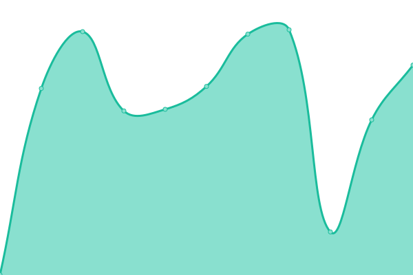
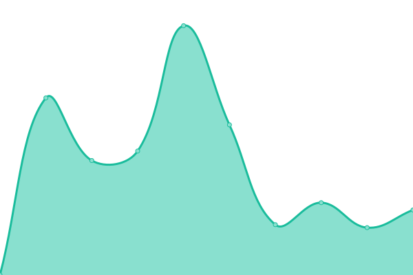

# [📈 Live Status](https://status.vnrobo.com): <!--live status--> **All systems operational**

This repository contains the open-source uptime monitor and status page for [Nguyen Anh Tuan](https://status.vnrobo.com), powered by [Upptime](https://github.com/upptime/upptime).

With [Upptime](https://upptime.js.org), you can get your own unlimited and free uptime monitor and status page, powered entirely by a GitHub repository. We use [Issues](https://github.com/nguyenanhtuan1008/status/issues) as incident reports, [Actions](https://github.com/nguyenanhtuan1008/status/actions) as uptime monitors, and [Pages](https://status.vnrobo.com) for the status page.

<!--start: status pages-->
<!-- This summary is generated by Upptime (https://github.com/upptime/upptime) -->
<!-- Do not edit this manually, your changes will be overwritten -->
<!-- prettier-ignore -->
| URL | Status | History | Response Time | Uptime |
| --- | ------ | ------- | ------------- | ------ |
|  [VnRobo Landing](https://vnrobo.com) | 🟩 Up | [vn-robo-landing.yml](https://github.com/nguyenanhtuan1008/status/commits/HEAD/history/vn-robo-landing.yml) | 

 846ms
     
 | 

<a href="https://status.vnrobo.com/history/vn-robo-landing">98.89%</a>
    

|  [VnRobo Blog](https://vnrobo.com/blog) | 🟩 Up | [vn-robo-blog.yml](https://github.com/nguyenanhtuan1008/status/commits/HEAD/history/vn-robo-blog.yml) | 

 2423ms
     
 | 

<a href="https://status.vnrobo.com/history/vn-robo-blog">98.89%</a>
    

|  [VnRobo SaaS](https://saas.vnrobo.com) | 🟩 Up | [vn-robo-saa-s.yml](https://github.com/nguyenanhtuan1008/status/commits/HEAD/history/vn-robo-saa-s.yml) | 

 1292ms
     
 | 

<a href="https://status.vnrobo.com/history/vn-robo-saa-s">96.99%</a>
    

|  [VnRobo Sign Up](https://saas.vnrobo.com/en/sign-up) | 🟩 Up | [vn-robo-sign-up.yml](https://github.com/nguyenanhtuan1008/status/commits/HEAD/history/vn-robo-sign-up.yml) | 

 906ms
     
 | 

<a href="https://status.vnrobo.com/history/vn-robo-sign-up">96.89%</a>
    

<!--end: status pages-->

[**Visit our status website →**](https://status.vnrobo.com)

## 📄 License

- Powered by: [Upptime](https://github.com/upptime/upptime)
- Code: [MIT](./LICENSE) © [Anand Chowdhary](https://anandchowdhary.com), supported by [Pabio](https://pabio.com)
- Data in the `./history` directory: [Open Database License](https://opendatacommons.org/licenses/odbl/1-0/)
